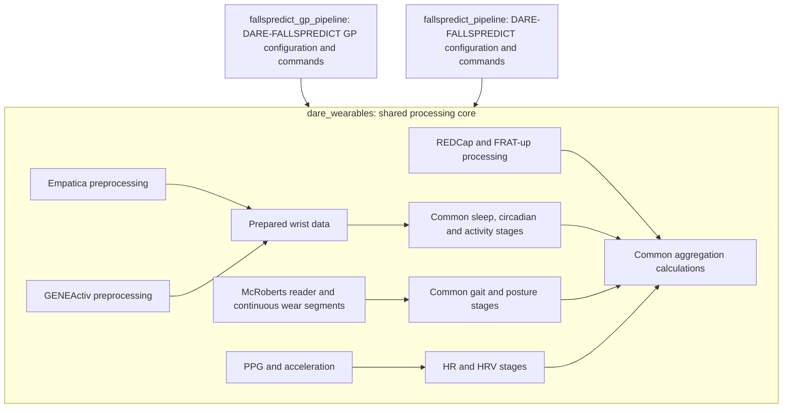

# DARE wearable processing architecture

DARE-FALLSPREDICT GP and DARE-FALLSPREDICT are sibling adapters over one shared core. Keep cohort
configuration and sensor discovery in the adapters and common calculations in
`dare_wearables`. The dependency arrows point from the adapters into the core.

## DARE-FALLSPREDICT GP workflow detail

The following diagram describes the DARE-FALLSPREDICT GP entry points and processing stages.
The historical `fallspredict_gp_pipeline` module paths remain compatibility entry points into
the shared core. DARE-FALLSPREDICT substitutes GENEActiv preprocessing and its own default
paths while using the same wrist and lower-back calculations.

```mermaid
flowchart TD
  classDef input fill:#edf4ff,stroke:#5b7fb9,color:#1c2d4a;
  classDef process fill:#f7f7f7,stroke:#888,color:#222;
  classDef output fill:#eef8ee,stroke:#5b9a5b,color:#173817;
  classDef launch fill:#fff4dc,stroke:#d29c31,color:#4b3200;

  subgraph LB["1. Lower-back McRoberts IMU pipeline"]
    LB_LAUNCH["Pipeline launch and configuration
    run_lower_back_pipeline.ipynb
    gp-lower-back
    configs/lower_back.local.toml"]:::launch
    LB_OMX["Raw McRoberts Dynaport MoveMonitor files
    input_base_path/{participant}/{visit}/Lower Back"]:::input
    LB_REDCAP["Participant metadata
    REDCap height file and cohort label"]:::input
    LB_DECODE["Decode OMX to raw acceleration
    Extract device time and sampling frequency"]:::process
    LB_TSQC["Timestamp and sampling QC
    Detect non-monotonic timestamps
    Detect missing samples"]:::process
    LB_CAL["Acceleration autocalibration
    van Hees-style offset, scale, and temperature calibration"]:::process
    LB_NONWEAR["Non-wear detection
    Van Hees triaxial acceleration approach"]:::process
    LB_ORIENT["Orientation correction
    Align lower-back sensor axes"]:::process
    LB_GAIT["Free-living gait extraction
    Walking-bout detection
    Temporal, amount, intensity, variability,
    quality, asymmetry, and distribution features"]:::process
    LB_POSTURE["Posture and lying detection
    Derive time-in-bed candidate periods"]:::process
    LB_TIB["Time-in-bed selection
    Merge candidate intervals
    Select largest night overlap"]:::process
    LB_GAIT_OUT["Lower-back gait outputs
    gait_daily_amounts.csv
    gait_bout_features.csv
    valid_days.csv
    cohort_summary.csv"]:::output
    LB_TIB_OUT["Lower-back time-in-bed outputs
    tib_candidates.csv
    tib_summary.csv"]:::output
  end

  subgraph WS["2. Empatica wrist sleep, circadian, and activity-intensity pipeline"]
    WS_LAUNCH["Pipeline launch and configuration
    run_wrist_sleep_pipeline.ipynb
    gp-empatica-sleep
    configs/empatica_sleep.local.toml"]:::launch
    WS_ACC_TEMP["Empatica acceleration and temperature
    silver/{participant}/{visit}/Empatica/acc.parquet
    silver/{participant}/{visit}/Empatica/tmp.parquet"]:::input
    WS_DIARY["Optional sleep diary
    diary_sleep_file"]:::input
    WS_TRACKER["Optional tracker outputs
    tracker_activity_file
    tracker_sleep_file"]:::input
    WS_LOAD["Load and align wrist signals
    Normalize timestamps
    Verify visit folders and required files"]:::process
    WS_CAL["Acceleration autocalibration
    Configure epoch length and clipping"]:::process
    WS_NONWEAR["Charging and DETACH non-wear detection
    Use temperature and acceleration windows"]:::process
    WS_SIB["Sustained inactivity bouts
    Identify low-angle-change periods"]:::process
    WS_HDCZA["Sleep window detection
    Heuristic Distribution Centered Zenith Angle"]:::process
    WS_GUIDERS["Sleep-window guider selection
    sleep_diary
    HDCZA
    lower_back_tib
    mean or median fallback"]:::process
    WS_SLEEP_SUM["Sleep feature extraction
    Sleep period timing, duration,
    fragmentation, sleep quality,
    movement, and non-wear summaries"]:::process
    WS_SLEEP_OUT["Sleep outputs
    sleep_outputs.csv
    sleep_daily.csv
    sleep_windows_hdcza.csv
    sib_periods.csv
    sleep_nonwear.csv"]:::output
    WS_CIRCADIAN["Circadian rhythm analysis
    Cosinor and non-parametric rhythm metrics
    Active/inactive windows and interdaily stability"]:::process
    WS_CIRCADIAN_OUT["Circadian outputs
    circadian/circadian_summary.csv
    circadian/circadian_timeseries.csv"]:::output
    WS_ACTIVITY["Activity-intensity analysis
    Select valid waking wear windows
    Classify acceleration intensity"]:::process
    WS_ACTIVITY_OUT["Activity-intensity outputs
    activity_intensity/activity_intensity_summary.csv
    activity_intensity/activity_intensity_timeseries.csv"]:::output
  end

  subgraph HR["3. Empatica BeliefPPG heart-rate pipeline"]
    HR_LAUNCH["Pipeline launch and configuration
    run_heart_rate_pipeline.ipynb
    gp-heart-rate
    configs/heart_rate.local.toml"]:::launch
    HR_PPG_ACC["Empatica PPG and acceleration
    silver/{participant}/{visit}/Empatica/ppg.parquet
    silver/{participant}/{visit}/Empatica/acc.parquet"]:::input
    HR_GAPS["Recording portion selection
    Split around acceleration gaps > 1 s
    Keep good portions >= 10 min"]:::process
    HR_BELIEF["BeliefPPG inference
    Run on portions >= 5 min
    Produce 2 s heart-rate estimates
    with uncertainty"]:::process
    HR_OUT["Heart-rate output
    {output_subdir}/hr_belief.csv
    current config: beliefppg/hr_belief.csv"]:::output
  end

  subgraph HRV["4. Empatica nocturnal HRV pipeline"]
    HRV_LAUNCH["Pipeline launch and configuration
    run_hrv_pipeline.ipynb
    gp-hrv
    configs/hrv.local.toml"]:::launch
    HRV_PPG_ACC["Empatica PPG and acceleration
    silver/{participant}/{visit}/Empatica/ppg.parquet
    silver/{participant}/{visit}/Empatica/acc.parquet"]:::input
    HRV_WINDOWS["Sleep-window source
    Prefer wrist sleep output
    Optional fallback sleep-window file"]:::input
    HRV_SELECT["Select nocturnal analysis windows
    Use configured guider order
    Enforce per-window quality rules"]:::process
    HRV_RESTRICT["Restrict PPG and acceleration to sleep windows"]:::process
    HRV_MOTION["Movement burst detection
    Compute acceleration features
    Flag motion-contaminated periods"]:::process
    HRV_QUIET["Quiet-period selection
    Fixed-length windows with motion exclusion"]:::process
    HRV_BEATS["Beat detection and IBI construction
    Detect PPG peaks
    Build inter-beat intervals"]:::process
    HRV_CLEAN["IBI cleaning and window QC
    Remove implausible intervals
    Track discarded windows"]:::process
    HRV_METRICS["Nocturnal HRV metrics
    RMSSD, SDNN, mean HR,
    PIP, CSI, CVI, LF/HF,
    and related summaries"]:::process
    HRV_OUT["HRV outputs
    hrv/hrv_metrics.csv
    hrv/hrv_sleep_windows_selected.csv
    hrv/hrv_discarded_windows.csv
    hrv/hrv_participant_summary.csv"]:::output
  end

  subgraph AGG["5. Subject-level aggregation and analysis exports"]
    AGG_LAUNCH["Aggregation commands
    gp-aggregate-sleep
    gp-aggregate-hrv
    gp-aggregate-heart-rate
    gp-aggregate-gait
    gp-aggregate-activity-intensity
    gp-aggregate-all"]:::launch
    AGG_SLEEP["Sleep and circadian aggregation
    Aggregate valid sleep rows by guider
    mean or median across nights
    Append circadian metrics"]:::process
    AGG_HRV["HRV aggregation
    Filter participant-level outliers
    Aggregate RMSSD, SDNN, mean HR,
    PIP, and discarded-window summaries"]:::process
    AGG_HR["Heart-rate aggregation
    Use selected HRV sleep windows
    Compute median day and night HR
    and nocturnal HR dip"]:::process
    AGG_GAIT["Gait aggregation
    Select days with >16 valid hours
    Average daily amount features
    and gait-quality features"]:::process
    AGG_ACTIVITY["Activity-intensity aggregation
    Select summary durations for inactive,
    light, moderate, vigorous, and MVPA"]:::process
    AGG_ALL["Overall subject-level export
    Outer-merge available domain tables
    by subject and visit"]:::process
    AGG_OUT["Aggregation outputs
    silver/aggregation/*.csv
    overall_{visit}_sleep_mean.csv
    overall_{visit}_sleep_median.csv
    wearable codebook-ready tables"]:::output
  end

  LB_LAUNCH --> LB_OMX
  LB_LAUNCH --> LB_REDCAP
  LB_OMX --> LB_DECODE --> LB_TSQC --> LB_CAL --> LB_NONWEAR --> LB_ORIENT
  LB_REDCAP --> LB_GAIT
  LB_ORIENT --> LB_GAIT --> LB_GAIT_OUT
  LB_ORIENT --> LB_POSTURE --> LB_TIB --> LB_TIB_OUT

  WS_LAUNCH --> WS_ACC_TEMP --> WS_LOAD --> WS_CAL --> WS_NONWEAR --> WS_SIB --> WS_HDCZA
  WS_LAUNCH --> WS_DIARY --> WS_GUIDERS
  WS_LAUNCH --> WS_TRACKER
  LB_TIB_OUT -->|optional guider| WS_GUIDERS
  WS_HDCZA --> WS_GUIDERS --> WS_SLEEP_SUM --> WS_SLEEP_OUT
  WS_SLEEP_SUM --> WS_CIRCADIAN --> WS_CIRCADIAN_OUT
  WS_NONWEAR --> WS_ACTIVITY --> WS_ACTIVITY_OUT
  WS_TRACKER -->|optional comparator inputs| WS_SLEEP_SUM
  WS_TRACKER -->|optional comparator inputs| WS_ACTIVITY

  HR_LAUNCH --> HR_PPG_ACC --> HR_GAPS --> HR_BELIEF --> HR_OUT

  HRV_LAUNCH --> HRV_PPG_ACC --> HRV_RESTRICT
  HRV_LAUNCH --> HRV_WINDOWS --> HRV_SELECT
  WS_SLEEP_OUT -->|preferred sleep-window source| HRV_SELECT
  HRV_SELECT --> HRV_RESTRICT --> HRV_MOTION --> HRV_QUIET --> HRV_BEATS --> HRV_CLEAN --> HRV_METRICS --> HRV_OUT

  AGG_LAUNCH --> AGG_SLEEP
  AGG_LAUNCH --> AGG_HRV
  AGG_LAUNCH --> AGG_HR
  AGG_LAUNCH --> AGG_GAIT
  AGG_LAUNCH --> AGG_ACTIVITY
  WS_SLEEP_OUT --> AGG_SLEEP
  WS_CIRCADIAN_OUT --> AGG_SLEEP
  HRV_OUT --> AGG_HRV
  HRV_OUT -->|selected sleep windows| AGG_HR
  HR_OUT --> AGG_HR
  LB_GAIT_OUT --> AGG_GAIT
  WS_ACTIVITY_OUT --> AGG_ACTIVITY
  AGG_SLEEP --> AGG_ALL
  AGG_HRV --> AGG_ALL
  AGG_HR --> AGG_ALL
  AGG_GAIT --> AGG_ALL
  AGG_ACTIVITY --> AGG_ALL --> AGG_OUT
```

## Source Trail

- Workflow notebooks: `notebooks/run_lower_back_pipeline.ipynb`, `notebooks/run_wrist_sleep_pipeline.ipynb`, `notebooks/run_heart_rate_pipeline.ipynb`, and `notebooks/run_hrv_pipeline.ipynb`.
- CLI entry points: `gp-lower-back`, `gp-empatica-sleep`, `gp-heart-rate`, `gp-hrv`, and the `gp-aggregate-*` commands declared in `pyproject.toml`.
- Configuration files: `configs/lower_back.local.toml`, `configs/empatica_sleep.local.toml`, `configs/heart_rate.local.toml`, and `configs/hrv.local.toml`.
- Lower-back source modules: `src/fallspredict_gp_pipeline/lower_back/io.py`, `src/fallspredict_gp_pipeline/lower_back/pipeline.py`, and `src/fallspredict_gp_pipeline/lower_back/processing/*`.
- Wrist sleep, circadian, and activity source modules: `src/fallspredict_gp_pipeline/wrist/empatica/pipeline.py`, `src/fallspredict_gp_pipeline/wrist/empatica/config.py`, `src/fallspredict_gp_pipeline/wrist/empatica/sleep.py`, `src/fallspredict_gp_pipeline/wrist/empatica/circadian.py`, and `src/fallspredict_gp_pipeline/wrist/empatica/activity_intensity.py`.
- Heart-rate source modules: `src/fallspredict_gp_pipeline/wrist/heart_rate/pipeline.py`, `src/fallspredict_gp_pipeline/wrist/heart_rate/config.py`, and `src/fallspredict_gp_pipeline/wrist/heart_rate/io.py`.
- HRV source modules and documentation: `docs/hrv_pipeline.md`, `src/fallspredict_gp_pipeline/wrist/hrv/config.py`, `src/fallspredict_gp_pipeline/wrist/hrv/io.py`, `src/fallspredict_gp_pipeline/wrist/hrv/pipeline.py`, and `src/fallspredict_gp_pipeline/wrist/hrv/processing.py`.
- Aggregation modules: `src/fallspredict_gp_pipeline/aggregation/sleep.py`, `src/fallspredict_gp_pipeline/aggregation/hrv.py`, `src/fallspredict_gp_pipeline/aggregation/heart_rate.py`, `src/fallspredict_gp_pipeline/aggregation/gait.py`, `src/fallspredict_gp_pipeline/aggregation/activity_intensity.py`, and `src/fallspredict_gp_pipeline/aggregation/overall.py`.
